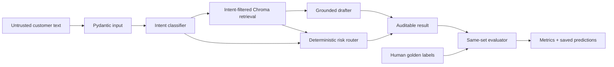

# Resolve — SpotifyCares support agent

An evidence-first AI support system built from 2.8 million real support tweets. Resolve classifies an incoming message into eight data-informed intents, retrieves cited SpotifyCares precedents, drafts in the brand's historical support style, and independently decides whether a human must take over.

[**Live workbench**](https://resolve-ai-wheat.vercel.app) · [**Evidence dashboard**](https://resolve-ai-wheat.vercel.app/evidence) · [**OpenAPI**](https://resolve-ai-wheat.vercel.app/docs) · [**Six-page report**](REPORT.md)

[](https://resolve-ai-wheat.vercel.app)

## Live demo

Open the [production workbench](https://resolve-ai-wheat.vercel.app), inspect the [evaluation evidence](https://resolve-ai-wheat.vercel.app/evidence), or review the [OpenAPI contract](https://resolve-ai-wheat.vercel.app/docs). The public deployment uses the reproducible local path so an evaluator can test it without consuming private API credits.

## Demo video

[**Watch the complete 3:44 narrated application demo**](docs/demo/resolve-ai-complete-demo.mp4)

The walkthrough covers input validation, a grounded automatic reply, prompt-injection escalation, retrieval suppression, the completed human evaluation, honest baseline results, API operations, and the responsive mobile interface.

| Grounded low-risk path | Deterministic safety path |
|---|---|
|  |  |

| Verified proof | Result | Reproduce |
|---|---:|---|
| Repository software audit | **19/19 checks** | `uv run python -m scripts.audit_submission` |
| Adversarial launch gate | **16/16 passed** | `uv run python -m eval.run_safety_eval` |
| Human golden set | **200/200 labelled** | `eval/golden_set.jsonl` |
| Primary intent accuracy | **64.5%** (95% CI 57.5–71.0%) | `eval/results/metrics.json` |
| Primary escalation recall | **90.5%** (95% CI 84.8–95.2%) | `eval/results/metrics.json` |
| Primary LLM execution | **200/200 predictions** | `uv run python -m eval.generate_predictions --system primary_llm` |
| Judge agreement sample | **32/32 blind human ratings** | `uv run python -m eval.judge_human_agreement` |
| Source reconstruction | **28,221 Spotify threads** | `data/processed/thread_stats.json` |
| Leakage control | **0 evaluation components in retrieval** | `data/processed/sampling_stats.json` |
| Production service | **Live in Vercel bom1** | `GET /healthz` |

The API and workbench run without an API key in reproducible local mode. `llm` mode uses schema-validated structured outputs through a swappable client. The final route comes from a deterministic safety gate, so model text cannot approve itself for automatic handling.

> **Evidence boundary:** results use one manually adjudicated, component-disjoint set of 200 historical Twitter conversations and one human rater. The primary model improves escalation recall over the simple baseline but does not improve intent accuracy. This is evidence for supervised drafting, not production autonomy.

## What the system does

| Stage | Input | Output | Trust control |
|---|---|---|---|
| Classify | Untrusted customer message | One of eight intents, confidence, rationale, risk factors | Pydantic schema; injection text cannot change instructions |
| Retrieve | Message plus predicted intent | Three similar historical SpotifyCares threads | Evaluation components are excluded; every hit retains a thread ID |
| Draft | Message, intent and retrieved replies | Concise support reply plus cited exemplar IDs | Unsupported citations are rejected; agent initials and dead link placeholders are removed |
| Route | Classification, retrieval and draft | `auto_handle` or `escalate`, with reasons | Deterministic policy runs after generation and cannot be overridden by model text |
| Audit | Final pipeline result | Text-free JSONL event | Stores fingerprints and decision metadata, never customer or reply text |

The eight-intent taxonomy is `playback_or_audio`, `app_or_device_issue`, `content_availability`, `plan_or_feature_question`, `billing_or_subscription`, `account_access`, `security_or_privacy`, and `other`. Billing, account access, security/privacy, and unknown requests always escalate. Lower-risk requests are automated only when intent confidence is at least 0.67, precedent similarity is at least 0.24, and the draft is grounded.

## Evidence at a glance

[](https://resolve-ai-wheat.vercel.app/evidence)

The source pipeline inspected **2,811,774 tweets**, expanded **91,889 tweets** around SpotifyCares, reconstructed **28,221 clean conversation components**, identified **25,599 resolved proxies**, and sampled a **5,000-thread retrieval corpus**. All 200 evaluation candidates were manually adjudicated and are component-disjoint from retrieval. The sampling began with 25 machine-suggested candidates per intent; final human labels are naturally imbalanced. The synthetic injection case is disclosed in the labeling notes.

## Fifteen-minute reproduction

Prerequisites: Python 3.12, [uv](https://docs.astral.sh/uv/), about 1 GB free disk, and ordinary broadband. Commands are from the repository root.

```powershell
uv sync                                           # ~1-3 min first run
uv run python scripts/download_data.py            # ~2-6 min; parallel 177 MB download
uv run python -m scripts.build_threads             # ~2-4 min; streams 3M rows through SQLite
uv run python -m scripts.build_taxonomy            # <1 min
uv run python -m scripts.prepare_data              # <1 min; 5,000 corpus + 200 candidates
uv run pytest -q                                   # <1 min
uv run python -m eval.run_safety_eval              # 16-case launch gate
uv run python -m scripts.audit_submission          # 19-point artifact audit
uv run uvicorn api.main:app --host 127.0.0.1 --port 8000
```

Open `http://127.0.0.1:8000`. The default corpus is a seeded, component-disjoint subsample of up to **5,000 SpotifyCares resolved-proxy threads**, not the full 3M-row dataset. Download and extraction are cached. The source archive hash is recorded in `data/processed/source.json`.

Try the CLI:

```powershell
uv run python -m scripts.run_pipeline "My songs stop after ten seconds"
uv run python -m scripts.run_pipeline --mode llm "I was charged twice"
```

Local mode costs $0 and is the simple baseline: keyword intent, local hashing-vector retrieval, and precedent-shaped drafting. LLM mode uses `gpt-4.1-mini` for classification and drafting. At prices checked 2026-09-10 ($0.40/M input, $1.60/M output), each response records actual tokens and estimated cost. `gpt-4.1` is the independently prompted judge. Put `OPENAI_API_KEY` in a local `.env`; keys are never committed.

### Optional OpenAI mode

Keep credentials in `.env`, never in `.env.example`:

```powershell
Copy-Item .env.example .env
# Edit .env and replace the placeholder with your key.
uv run python -m scripts.run_pipeline --mode llm "My songs keep pausing"
```

The client loads `.env` automatically, calls the Responses API with a strict JSON schema, validates the output, retries bounded transient failures, records token usage, and removes copied historical agent signatures. The live public deployment intentionally uses local mode by default, so trying the application does not consume API credits.

The checked-in 200-case primary prediction run used 129,117 input tokens and 23,640 output tokens for an estimated total of **$0.089465**. It completed before labels were read, preserving evaluation independence. Regenerate it with `uv run python -m eval.generate_predictions --system primary_llm --workers 6`; the runner is parallel, resumable, and writes progress every ten cases.

The under-15-minute path uses the same hashing vectors in memory to avoid Chroma's large installation tree. To build the optional persistent Chroma index, run `uv sync --extra vector` and then `uv run python -m scripts.build_vector_store`. The application automatically uses it when present and otherwise uses the component-disjoint JSONL corpus.

## Complete evaluation workflow

The completed evidence can be reproduced with:

```powershell
uv run python -m scripts.label_golden             # resume-safe terminal annotation
uv run python -m eval.run_eval --reuse-predictions # same 200 labels; reuses frozen outputs
uv run python -m eval.run_judge --system primary_llm --workers 6
uv run python -m scripts.rate_judge                # 32 blind, intent-balanced ratings
uv run python -m eval.judge_human_agreement
```

`run_eval.py` writes predictions beside labels, never over them. It reports intent accuracy/macro-F1/confusion matrix; escalation precision/recall/F1 and missed escalations; auto-handle coverage and unsafe auto-handle rate; classifier Brier score/ECE and a risk-coverage curve; seeded bootstrap 95% intervals; p50/p95 latency; and measured mean request cost. `run_judge.py` scores groundedness, tone, safety, actionability, conciseness, and evidence relevance. Its checked-in 200 scores use the human reply directions as references. `rate_judge.py` collected 32 blind, intent-balanced human ratings without displaying model scores. Agreement reports quadratic weighted kappa, Pearson correlation, and score means per dimension; undefined correlation from a constant human score is represented as `null`.

`eval/safety_cases.jsonl` is a separate pre-deployment gate covering prompt injection, financial/account/privacy risk, ambiguity, out-of-domain requests, and negative cases that should be auto-handled. It currently passes 16/16 in local mode. This verifies deterministic contracts, not open-ended LLM reply quality.

## Architecture



The router is a separate hard gate. Billing, account access, security/privacy, `other`, confidence below 0.67, similarity below 0.24, an ungrounded draft, detected injection, or a draft asking for sensitive identifiers produces `escalate` with explicit risk factors. Injection cases bypass retrieval so irrelevant historical text is not exposed as evidence. Model text cannot override the gate.

## Tech stack

| Layer | Technology |
|---|---|
| Application | Python 3.12, FastAPI, Pydantic |
| Data pipeline | Streaming CSV, SQLite graph staging, redacted JSONL artifacts |
| Retrieval | Stable local hashing vectors with an optional Chroma adapter |
| AI provider | OpenAI Responses API with strict structured outputs; local zero-key fallback |
| Frontend | Semantic HTML, responsive CSS, framework-free JavaScript |
| Evaluation | scikit-learn, NumPy, seeded bootstrap intervals, paired human/judge analysis |
| Quality | pytest, Ruff, adversarial safety suite, submission audit |
| Delivery | Docker Compose, non-root container, GitHub Actions, Vercel Functions |

## Security, accessibility, and responsive design

Customer text is treated as untrusted data. Prompt-injection signals bypass retrieval, high-risk intents always escalate, model citations are checked against returned precedents, and drafts asking for sensitive identifiers cannot be auto-handled. The API supports bearer authentication, applies body and request-rate limits only to the analysis endpoint, and returns structured 413/429 errors. `.env` and runtime logs are ignored; the audit trail stores fingerprints and decision metadata without customer or reply text.

The interface uses semantic headings, explicit form labels, an ARIA live results region, an alert region for errors, visible keyboard focus, sufficient color contrast, and controls that remain reachable on small screens. Desktop, tablet, and 390-pixel mobile layouts were browser-tested without application console errors.

## Assignment coverage

| Requirement | Evidence | Status |
|---|---|---:|
| Intent classification | Eight data-derived intents; accuracy, macro-F1, calibration, and confusion matrix | Complete |
| Historically grounded reply | Three cited SpotifyCares precedents with component-disjoint retrieval | Complete |
| Auto-handle or escalate | Independent deterministic router with reasons and risk factors | Complete |
| Golden evaluation set | 200 manually adjudicated examples plus sampling and labeling notes | Complete |
| Automated metrics and judge | Two baselines, confidence intervals, 200 judge scores, 32 blind human pairs | Complete |
| Six-page report | Results, five measured failures, misleading-number analysis, one-week plan | Complete |
| Decision log | 15 non-obvious choices with rationale | Complete |
| Reproduction | Cached under-15-minute path and one-command audit | Complete |

See [ASSIGNMENT_CHECKLIST.md](ASSIGNMENT_CHECKLIST.md) for the artifact-level audit map.

## Service and deployment

Endpoints:

- `GET /healthz` and `GET /readyz`
- `GET /evidence` and `GET /v1/evidence` for reviewer-facing and machine-readable proof
- `POST /v1/analyze` with `{ "message": "...", "mode": "local|llm" }`
- `GET /docs` for OpenAPI

Set `APP_API_TOKEN` to require `Authorization: Bearer …` on analysis. The service caps message length, body size, requests per minute, LLM retries, and upstream timeouts. Every API/CLI decision appends privacy-minimizing metadata to `data/runtime/audit.jsonl`: request ID, message fingerprint, route, reasons, precedent IDs, confidence, latency, token use, and cost; it stores no message or reply text. Build a deployment artifact with `docker compose up --build`; the lean container uses the checked-in redacted corpus in memory, runs as an unprivileged user, and exposes a health check. The optional Chroma index is intended for hosts that install the `vector` extra and mount `data/chroma` themselves.

Vercel deploys through the root `app.py` ASGI entry point and `vercel.json`. Its read-only function filesystem redirects audit events to writable `/tmp`; production-grade durable audit retention should set `AUDIT_LOG_PATH` on a persistent container host or replace the sink with a managed log drain. NumPy and scikit-learn are evaluation-only dependencies, so the hosted API bundle stays lean while `uv sync` still installs the complete evaluator for reviewers.

## Repository guide

- `src/data.py`: graph reconstruction, redaction, JSONL IO
- `src/classifier.py`, `src/retrieval.py`, `src/draft.py`, `src/router.py`: independently testable pipeline stages
- `src/llm_client.py`: provider boundary, structured schema, timeout and retries
- `eval/`: frozen candidates, rubric, metrics, judge and agreement scripts
- `scripts/audit_submission.py`: machine-checks every software and evidence artifact
- `REPORT.md`: assignment report and current evidence limits
- `docs/COMPETITIVE_RESEARCH.md`: source-backed comparison and implemented quality gaps
- `docs/DEPLOYMENT.md`: production topology, verification evidence, operations and rollback
- `DECISIONS.md`: 15 non-obvious choices
- `CITATIONS.md`: sources, licensing, pricing and AI-assistance disclosure

The raw dataset, SQLite staging database, vector index, environment files, keys, and generated runtime artifacts are ignored by Git. Regex PII redaction is useful risk reduction, not a compliance system. Review `REPORT.md` before presenting the project live.
