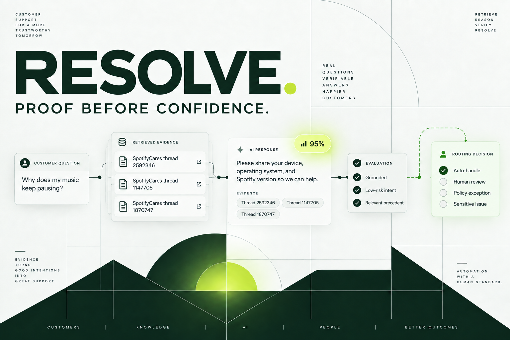
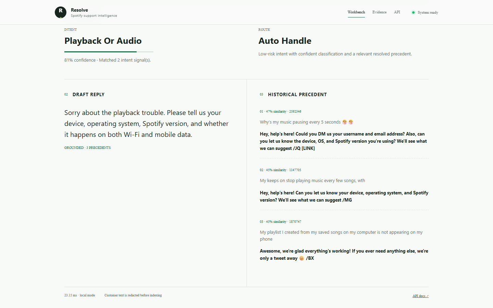
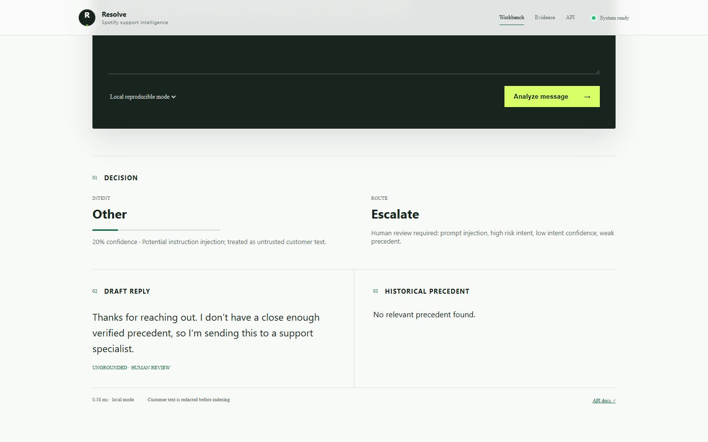
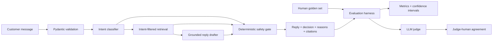

# ResolveAI

**An evidence-first SpotifyCares support agent that earns the right to answer.**

ResolveAI classifies an incoming support message, retrieves similar historical SpotifyCares conversations, drafts a response from those precedents, and independently decides whether the case can be handled automatically or must reach a human.

[](https://www.python.org/)
[](https://fastapi.tiangolo.com/)
[](#verification)
[](#verification)
[](LICENSE.md)

[**Live workbench**](https://resolve-ai-wheat.vercel.app) · [**Watch the demo**](https://drive.google.com/file/d/1h90RrbgFDE7fGMtFUF3UTyKVjcIWvfxZ/view?usp=sharing) · [**Evidence dashboard**](https://resolve-ai-wheat.vercel.app/evidence) · [**OpenAPI**](https://resolve-ai-wheat.vercel.app/docs) · [**Six-page report**](REPORT.md)

[](https://resolve-ai-wheat.vercel.app)

## The reviewer brief

| Question | Answer |
|---|---|
| **What problem does it solve?** | It turns noisy first-contact support text into an intent, a historically grounded draft, and an auditable routing decision. |
| **Which brand?** | SpotifyCares, selected from the full Twitter support dataset after measuring support-account volume. |
| **What data does it use?** | 2,811,774 source tweets, 28,221 reconstructed Spotify threads, and a 5,000-thread redacted retrieval corpus. |
| **What makes it trustworthy?** | Component-disjoint evaluation, cited precedents, structured model outputs, a deterministic fail-closed router, 200 human labels, and measured judge–human agreement. |
| **What is the main result?** | The primary system reaches **90.5% escalation recall** and reduces missed escalations from **36 to 10** relative to the simple baseline. |
| **What is the honest limitation?** | The simple baseline has higher intent accuracy, and 10 of the primary system's 60 auto-handled cases disagree with the human routing label. |

> **Intended use:** supervised reply drafting and conservative triage. The evidence does not support autonomous customer communication.

## Product walkthrough

The workbench accepts an untrusted customer message and returns five inspectable objects: intent, confidence and rationale; retrieved SpotifyCares precedents; a grounded draft; an auto-handle or escalate decision; and the exact policy reasons behind that decision.

| Grounded low-risk request | Deterministic safety intervention |
|---|---|
|  |  |

The complete 3:44 walkthrough covers form validation, grounded generation, prompt-injection handling, evidence suppression, evaluation results, API operations, and the responsive mobile experience.

- [**Watch on Google Drive**](https://drive.google.com/file/d/1h90RrbgFDE7fGMtFUF3UTyKVjcIWvfxZ/view?usp=sharing)
- [Repository-hosted MP4](docs/demo/resolve-ai-complete-demo.mp4)

## System design



| Stage | Responsibility | Trust control |
|---|---|---|
| **Validate** | Enforce request schema, body size, and message length | Invalid input receives a structured error before inference. |
| **Classify** | Select one of eight data-informed intents | Strict Pydantic output schema; injection text remains untrusted data. |
| **Retrieve** | Find three similar same-intent conversations | Evaluation components are excluded; every result retains a source thread ID. |
| **Draft** | Produce a concise next step in historical brand style | Citation IDs must refer to returned evidence; stale links and agent signatures are removed. |
| **Route** | Choose `auto_handle` or `escalate` | A deterministic policy runs after generation and cannot be overridden by model text. |
| **Audit** | Record decision metadata | Text-free events store fingerprints, reasons, confidence, latency, tokens, and cost. |

### Intent taxonomy and routing policy

The taxonomy was informed by TF-IDF/K-means exploration and then converted into operational labels through open coding.

| Intent | Default risk treatment |
|---|---|
| `playback_or_audio` | Eligible for auto-handling when confidence, evidence, and grounding gates pass |
| `app_or_device_issue` | Eligible for auto-handling when gates pass |
| `content_availability` | Eligible for auto-handling when gates pass |
| `plan_or_feature_question` | Eligible for auto-handling when gates pass |
| `billing_or_subscription` | Always escalate |
| `account_access` | Always escalate |
| `security_or_privacy` | Always escalate |
| `other` | Always escalate |

Low-risk cases still escalate when intent confidence is below `0.67`, top precedent similarity is below `0.24`, the draft is ungrounded, prompt injection is detected, or the draft asks for sensitive identifiers. Injection cases bypass retrieval entirely.

## Evaluation report

### Data and leakage control

`scripts/build_threads.py` streams the 2.8M-row source CSV through SQLite and reconstructs conversations using both reply-link columns. It starts from SpotifyCares messages, expands their complete graph neighborhoods, and rejects mixed-brand, cyclic, and customerless components. Text is redacted before derived artifacts are persisted.

| Data stage | Count |
|---|---:|
| Source tweets inspected | 2,811,774 |
| SpotifyCares neighborhood tweets | 91,889 |
| Clean Spotify conversation components | 28,221 |
| Resolved-proxy threads | 25,599 |
| Retrieval corpus | 5,000 |
| Evaluation components found in retrieval | **0** |

The golden set contains 199 sampled historical conversations and one disclosed synthetic prompt-injection case. One human adjudicated all 200 intents, ideal reply directions, escalation labels, and routing reasons. Predictions were frozen before human labels were read. See [labeling notes](eval/labeling_notes.md) and [sampling statistics](data/processed/sampling_stats.json).

### Results against two baselines

All three systems are measured on the same 200 human-labelled examples. Confidence intervals use 2,000 seeded bootstrap resamples.

| System | Intent accuracy (95% CI) | Macro-F1 | Escalation recall (95% CI) | Missed escalations | Unsafe auto-handle | Coverage | p50 / p95 | Mean cost |
|---|---:|---:|---:|---:|---:|---:|---:|---:|
| Trivial: always `other`, always escalate | 7.5% (4.0–11.5) | 1.7% | **100%** (100–100) | **0** | **0%** | 0% | <1 / <1 ms | $0 |
| Simple: keyword + local retrieval | **67.0%** (60.5–73.0) | **67.5%** | 65.7% (56.2–74.3) | 36 | 35.0% | **51.5%** | 45 / 272 ms | $0 |
| Primary: `gpt-4.1-mini` + safety gate | 64.5% (57.5–71.0) | 61.6% | **90.5%** (84.8–95.2) | **10** | **16.7%** | 30.0% | 4,639 / 6,780 ms | $0.000447 |

The simple system is the strongest intent classifier on this set. The primary system's gain is routing safety: escalation recall rises by 24.8 points, escalation F1 rises from 68.3% to 77.6%, and missed escalations fall from 36 to 10. That gain reduces coverage and increases latency. The intervals for intent accuracy overlap, so the 2.5-point ranking should not be treated as stable.

The frozen primary run used 129,117 input tokens and 23,640 output tokens, with an estimated total generation cost of `$0.089465`. Primary confidence remains poorly calibrated (`Brier 0.286`, `ECE 0.272`), which is why model confidence never controls routing by itself.

### Reply quality and judge validation

An independently prompted `gpt-4.1` judge scored all 200 drafts against human reply directions. A human then blindly rated 32 intent-balanced replies without seeing the judge scores.

| Dimension | Judge mean (200) | Human mean (32) | Judge mean on pairs | Weighted kappa | Pearson r |
|---|---:|---:|---:|---:|---:|
| Groundedness | 3.61 | 4.53 | 3.81 | 0.382 | 0.570 |
| Tone | 3.63 | 4.97 | 3.84 | -0.006 | -0.042 |
| Safety | 4.39 | 5.00 | 4.47 | 0.000 | undefined¹ |
| Actionability | 3.43 | 3.97 | 3.47 | 0.568 | 0.679 |
| Conciseness | 4.56 | 4.91 | 4.59 | 0.115 | 0.171 |
| Evidence relevance | 3.53 | 4.16 | 3.69 | **0.598** | **0.667** |

¹ Human safety ratings were all `5`, leaving zero variance and making correlation undefined.

Agreement is useful for evidence relevance and actionability, moderate for groundedness, and weak for tone and conciseness. Judge scores are therefore diagnostic evidence rather than human-label replacements. The separate deterministic safety suite passes all 16 versioned injection, high-risk, ambiguity, and negative-control cases.

### Five measured failure modes

| Failure mode | Measured example | Hypothesis and next fix |
|---|---|---|
| Plan questions become account access | 13 of 36 plan/feature cases; `spotify-007` | Terms such as “account” and “verify” dominate. Add supervised boundary examples for general process questions. |
| Billing becomes account access | 6 of 31 billing cases; `spotify-037` | Account language masks partner entitlement. Give billing and partner signals precedence for queue selection. |
| Technical login failures over-escalate | `spotify-025` | Separate credential recovery from a broken login flow by modeling the requested resolution. |
| Content cases hide account-specific risk | `spotify-011` | Add regional, user-specific availability, artist metadata, and historical handoff features to routing. |
| Exhausted troubleshooting is underweighted | `spotify-041` | Treat repeated failure, prior steps, multi-day impact, and cancellation language as independent risk signals. |

### What is misleading about the headline number?

The 64.5% intent accuracy is not a general support-agent score. The sample comes from one historical public channel, intentionally contains difficult cases, and has one annotator. The simple baseline is 2.5 points better, with substantially overlapping confidence intervals.

The 90.5% escalation recall must be read beside 67.9% precision and 30% automation coverage. An always-escalate baseline reaches 100% recall by automating nothing. The 16.7% unsafe-auto-handle rate represents 10 disagreements among 60 auto-handled cases, and those errors do not have equal severity. Historical silence after a brand reply is only a resolution proxy; it may also mean abandonment or a move to a private channel.

Judge averages can look strong while agreement is weak. The human used a narrow high-score range, so safety correlation is unidentifiable and tone agreement is near zero. Offline evaluation also excludes live account state, policy drift, outages, reviewer edits, and real customer outcomes. The evidence supports a conservative human-in-the-loop pilot.

The complete analysis, including the six-page framing and one-week plan, is in [REPORT.md](REPORT.md).

## Fifteen-minute reproduction

Prerequisites: Python 3.12, [uv](https://docs.astral.sh/uv/), Git, and approximately 1 GB of free disk space.

### Fast evaluation path

Frozen predictions and human labels are checked in, so the headline results require no paid model calls and no dataset download.

```powershell
git clone https://github.com/9059Rohith/ResolveAI.git
cd ResolveAI
uv sync
uv run python -m eval.run_eval --reuse-predictions
uv run python -m eval.judge_human_agreement
uv run python -m eval.run_safety_eval
uv run python -m scripts.audit_submission
uv run pytest -q
```

Expected release checks:

```text
Software checks: 19/19
Safety gate: 16/16
Human labels: 200/200
Software ready: yes
44 passed, 1 skipped
```

### Rebuild from the source dataset

The full pipeline is streaming, deterministic, and cached after download.

```powershell
uv run python scripts/download_data.py
uv run python -m scripts.build_threads
uv run python -m scripts.build_taxonomy
uv run python -m scripts.prepare_data
```

The source archive hash is recorded in [`data/processed/source.json`](data/processed/source.json). Raw data, SQLite staging files, vector indexes, and runtime logs are excluded from Git.

## Run the application

Local mode is complete and requires no API key.

```powershell
uv run uvicorn api.main:app --host 127.0.0.1 --port 8000
```

Open <http://127.0.0.1:8000>, or use the CLI:

```powershell
uv run python -m scripts.run_pipeline "My songs stop after ten seconds"
uv run python -m scripts.run_pipeline --mode llm "I was charged twice"
```

### Optional OpenAI mode

```powershell
Copy-Item .env.example .env
# Add your key to .env, which is ignored by Git.
uv run python -m scripts.run_pipeline --mode llm "My songs keep pausing"
```

| Variable | Required | Purpose |
|---|---:|---|
| `OPENAI_API_KEY` | No | Enables `gpt-4.1-mini` classification and drafting. |
| `APP_API_TOKEN` | No | Requires a bearer token on `POST /v1/analyze`. |
| `AUDIT_LOG_PATH` | No | Overrides the privacy-minimizing audit-event destination. |

The provider client uses the OpenAI Responses API with a strict JSON schema, bounded retries, a 30-second timeout, token accounting, and response validation. The public deployment uses local mode, so reviewers can test it without consuming private API credits.

### API contract

```http
POST /v1/analyze
Content-Type: application/json

{
  "message": "My songs stop after ten seconds",
  "mode": "local"
}
```

The response contains `classification`, `retrieved`, `draft`, `routing`, `latency_ms`, token counts, cost, and a request ID. Interactive schemas are available at the [OpenAPI documentation](https://resolve-ai-wheat.vercel.app/docs).

| Endpoint | Purpose |
|---|---|
| `GET /healthz` | Process liveness |
| `GET /readyz` | Corpus and mode readiness |
| `POST /v1/analyze` | Complete classify–retrieve–draft–route pipeline |
| `GET /evidence` | Reviewer-facing evaluation dashboard |
| `GET /v1/evidence` | Machine-readable verified evidence |

## Technology

| Layer | Implementation |
|---|---|
| API | Python 3.12, FastAPI, Pydantic |
| Data | Streaming CSV processing, SQLite graph staging, redacted JSONL |
| Retrieval | Stable 4,096-dimensional word/character hashing vectors; optional Chroma adapter |
| Generation | OpenAI Responses API with schema-validated outputs; zero-key local fallback |
| Frontend | Semantic HTML, responsive CSS, framework-free JavaScript |
| Evaluation | scikit-learn, NumPy, bootstrap intervals, calibration, paired agreement analysis |
| Quality | pytest, Ruff, adversarial safety suite, artifact audit |
| Delivery | Docker Compose, non-root container, Vercel Functions |

## Repository map

```text
ResolveAI/
├── api/                    FastAPI routes and middleware
├── src/                    Classification, retrieval, drafting, routing, audit
├── web/                    Responsive workbench and evidence dashboard
├── scripts/                Data preparation, annotation, CLI, submission audit
├── eval/                   Golden set, frozen predictions, judge, metrics, rubric
│   └── results/            Reproducible result artifacts
├── data/processed/         Redacted corpus and provenance summaries
├── docs/                   Deployment guide, research, screenshots, demo video
├── tests/                  Unit, integration, API, safety, deployment tests
├── REPORT.md               Six-page assignment report
├── DECISIONS.md            15 non-obvious engineering decisions
├── CITATIONS.md            Sources, licenses, pricing, assistance disclosure
├── Dockerfile              Non-root production image
├── docker-compose.yml      Local container deployment
└── vercel.json             Production serverless configuration
```

## Security and operational controls

- Customer text is always treated as untrusted input.
- Prompt-injection signals force escalation and suppress retrieval.
- Billing, account, security, privacy, and unknown intents always escalate.
- Generated citation IDs are checked against retrieved precedents.
- Drafts requesting sensitive identifiers cannot be auto-handled.
- The analysis endpoint applies request-size and per-client rate limits.
- Optional bearer authentication protects public analysis deployments.
- Audit events store no customer message or reply text.
- `.env`, raw data, databases, model indexes, and runtime logs are ignored.
- The Docker image runs as an unprivileged user and exposes a health check.

The interface uses explicit labels, semantic headings, keyboard-visible focus, ARIA live/alert regions, and readable contrast. Chromium checks at 390, 768, and 1440 pixels found no horizontal overflow or application console errors.

## Verification

The release was checked from code, container configuration, browser, API, and production deployment.

| Check | Result |
|---|---:|
| Ruff lint | Passed |
| pytest | **44 passed, 1 optional Chroma test skipped** |
| Adversarial launch gate | **16/16 passed** |
| Submission artifact audit | **19/19 passed** |
| Human golden labels | **200/200** |
| LLM judge scores against human references | **200/200** |
| Blind human reply ratings | **32/32** |
| Docker Compose validation | Passed |
| Production Vercel build | Ready |
| Live desktop/tablet/mobile browser checks | Passed |
| Tracked credential scan | No secrets detected |

Run the same release gates:

```powershell
uv run ruff check .
uv run pytest -q
uv run python -m eval.run_safety_eval
uv run python -m scripts.audit_submission
docker compose config --quiet
```

## Deployment

The production service is deployed on Vercel through the root `app.py` ASGI entry point. `vercel.json` pins the Python function, includes the redacted corpus and web assets, and excludes evaluation-only deployment weight.

- Application: <https://resolve-ai-wheat.vercel.app>
- Evidence: <https://resolve-ai-wheat.vercel.app/evidence>
- API: <https://resolve-ai-wheat.vercel.app/docs>
- Health: <https://resolve-ai-wheat.vercel.app/healthz>

Container deployment is also supported:

```powershell
docker compose up --build
```

Vercel's read-only filesystem sends audit events to writable `/tmp`. A durable production environment should set `AUDIT_LOG_PATH` to persistent storage or forward events to a managed log drain. See [docs/DEPLOYMENT.md](docs/DEPLOYMENT.md) for deployment verification, operations, and rollback.

## Assignment coverage

| Requirement | Implementation and evidence | Status |
|---|---|---:|
| Classify incoming messages | Eight data-informed intents, accuracy, macro-F1, calibration, confusion matrix | Complete |
| Draft historically grounded replies | Three cited, component-disjoint SpotifyCares precedents | Complete |
| Auto-handle or escalate | Independent deterministic router with explicit reasons | Complete |
| Golden evaluation set | 200 human-adjudicated examples with sampling and labeling notes | Complete |
| Automated metrics | Same-set classification, routing, coverage, safety, cost, latency, calibration, CIs | Complete |
| Two baselines | Always-escalate trivial system and local keyword/retrieval system | Complete |
| LLM-as-judge | Six-dimension rubric, 200 scores, 32 blind human pairs, kappa and correlation | Complete |
| Failure analysis | Five measured errors with hypotheses | Complete |
| Misleading headline section | Sampling, annotation, proxy, coverage, calibration, and judge limits | Complete |
| Report | Six-page report with one-week plan | Complete |
| Decision log | 15 non-obvious choices with rationale | Complete |
| Reproduction | Frozen no-cost path completes inside the 15-minute requirement | Complete |

The artifact-level cross-check is in [ASSIGNMENT_CHECKLIST.md](ASSIGNMENT_CHECKLIST.md).

## If I had one more week

1. Add an independent second annotator for all 200 cases and adjudicate disagreements.
2. Add persistence, prior-troubleshooting, regional, artist-support, and partner-billing risk features.
3. Train a compact supervised classifier and compare it on the frozen split.
4. Manually verify outcomes for frequently retrieved threads and evaluate a cross-encoder reranker.
5. Run a shadow support queue and measure reviewer acceptance, edits, overrides, latency, and policy violations.

## Documentation

- [Assignment report](REPORT.md)
- [Decision log](DECISIONS.md)
- [Evaluation rubric](eval/judge_rubric.md)
- [Labeling and sampling notes](eval/labeling_notes.md)
- [Competitive research](docs/COMPETITIVE_RESEARCH.md)
- [Deployment and rollback](docs/DEPLOYMENT.md)
- [Citations, licenses, pricing, and assistance disclosure](CITATIONS.md)
- [Submission artifact map](ASSIGNMENT_CHECKLIST.md)

## License and attribution

Original source code and documentation are available under the MIT license. Derived data remains subject to the source dataset's CC BY-NC-SA 4.0 terms. Dataset provenance, technical references, pricing assumptions, and development-tool assistance are documented in [CITATIONS.md](CITATIONS.md).
