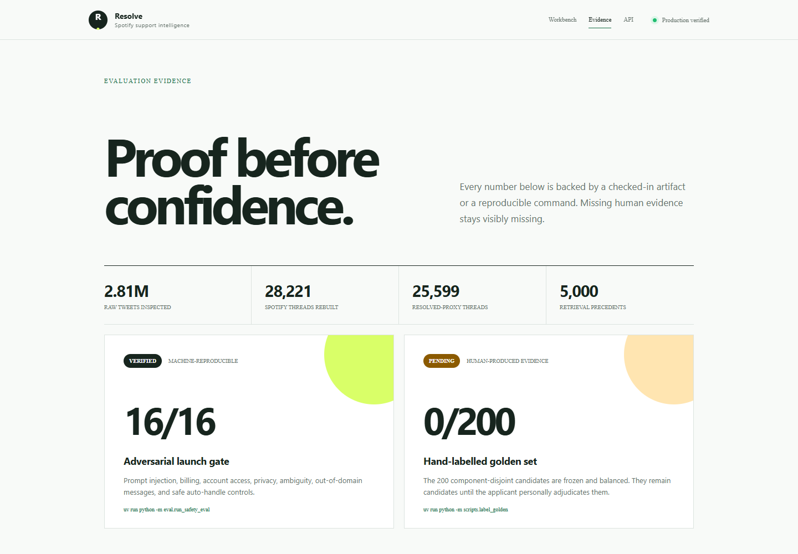
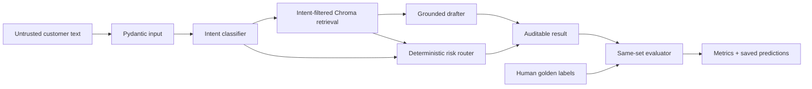

# Resolve — SpotifyCares support agent

An evidence-first AI support system built from 2.8 million real support tweets. Resolve classifies an incoming message into eight data-informed intents, retrieves cited SpotifyCares precedents, drafts in the brand's historical support style, and independently decides whether a human must take over.

[**Live workbench**](https://resolve-ai-wheat.vercel.app) · [**Evidence dashboard**](https://resolve-ai-wheat.vercel.app/evidence) · [**OpenAPI**](https://resolve-ai-wheat.vercel.app/docs) · [**Six-page report**](REPORT.md)

[](https://resolve-ai-wheat.vercel.app/evidence)

| Verified proof | Result | Reproduce |
|---|---:|---|
| Repository software audit | **15/15 checks** | `uv run python -m scripts.audit_submission` |
| Adversarial launch gate | **16/16 passed** | `uv run python -m eval.run_safety_eval` |
| Source reconstruction | **28,221 Spotify threads** | `data/processed/thread_stats.json` |
| Leakage control | **0 evaluation components in retrieval** | `data/processed/sampling_stats.json` |
| Production service | **Live in Vercel bom1** | `GET /healthz` |

The API and workbench run without an API key in reproducible local mode. `llm` mode uses schema-validated structured outputs through a swappable client. The final route comes from a deterministic safety gate, so model text cannot approve itself for automatic handling.

> **Evidence boundary:** `eval/golden_set.jsonl` contains 200 frozen, component-disjoint annotation candidates. They are not represented as a hand-labelled golden set. Headline accuracy, reply-quality, and judge-agreement results stay withheld until the applicant personally completes the required labels and ratings.

## Fifteen-minute reproduction

Prerequisites: Python 3.12, [uv](https://docs.astral.sh/uv/), about 1 GB free disk, and ordinary broadband. Commands are from the repository root.

```powershell
uv sync                                           # ~1–3 min first run
uv run python scripts/download_data.py            # ~2–6 min; parallel 177 MB download
uv run python -m scripts.build_threads             # ~2–4 min; streams 3M rows through SQLite
uv run python -m scripts.build_taxonomy            # <1 min
uv run python -m scripts.prepare_data              # <1 min; 5,000 corpus + 200 candidates
uv run pytest -q                                   # <1 min
uv run python -m eval.run_safety_eval              # 16-case launch gate
uv run python -m scripts.audit_submission          # 14-point artifact audit
uv run uvicorn api.main:app --host 127.0.0.1 --port 8000
```

Open `http://127.0.0.1:8000`. The default corpus is a seeded, component-disjoint subsample of up to **5,000 SpotifyCares resolved-proxy threads**, not the full 3M-row dataset. Download and extraction are cached. The source archive hash is recorded in `data/processed/source.json`.

Try the CLI:

```powershell
uv run python -m scripts.run_pipeline "My songs stop after ten seconds"
uv run python -m scripts.run_pipeline --mode llm "I was charged twice"
```

Local mode costs $0 and is the simple baseline: keyword intent, local hashing-vector retrieval, and precedent-shaped drafting. LLM mode uses `gpt-4.1-mini` for classification and drafting. At prices checked 2026-09-10 ($0.40/M input, $1.60/M output), each response records actual tokens and estimated cost. `gpt-4.1` is the independently prompted judge. Put `OPENAI_API_KEY` in a local `.env`; keys are never committed.

The under-15-minute path uses the same hashing vectors in memory to avoid Chroma's large installation tree. To build the optional persistent Chroma index, run `uv sync --extra vector` and then `uv run python -m scripts.build_vector_store`. The application automatically uses it when present and otherwise uses the component-disjoint JSONL corpus.

## Complete evaluation workflow

The official dataset requires human work by definition:

```powershell
uv run python -m scripts.label_golden             # resume-safe terminal annotation
uv run python -m eval.run_eval                     # same 200 labels, all three systems
uv run python -m eval.run_judge --system primary_llm
# Human scores at least 30 matching rows into eval/human_judge_scores.jsonl
uv run python -m eval.judge_human_agreement
```

`run_eval.py` writes predictions beside labels, never over them. It reports intent accuracy/macro-F1/confusion matrix; escalation precision/recall/F1 and missed escalations; auto-handle coverage and unsafe auto-handle rate; classifier Brier score/ECE and a risk-coverage curve; seeded bootstrap 95% intervals; p50/p95 latency; and measured mean request cost. `run_judge.py` scores groundedness, tone, safety, actionability, conciseness, and evidence relevance. Agreement reports quadratic weighted kappa, Pearson correlation, score means per dimension, and rejects fewer than 30 pairs.

`eval/safety_cases.jsonl` is a separate pre-deployment gate covering prompt injection, financial/account/privacy risk, ambiguity, out-of-domain requests, and negative cases that should be auto-handled. It currently passes 16/16 in local mode. This verifies deterministic contracts, not open-ended LLM reply quality.

## Architecture



The router is a separate hard gate. Billing, account access, security/privacy, `other`, confidence below 0.67, similarity below 0.24, an ungrounded draft, detected injection, or a draft asking for sensitive identifiers produces `escalate` with explicit risk factors. Injection cases bypass retrieval so irrelevant historical text is not exposed as evidence. Model text cannot override the gate.

## Service and deployment

Endpoints:

- `GET /healthz` and `GET /readyz`
- `GET /evidence` and `GET /v1/evidence` for reviewer-facing and machine-readable proof
- `POST /v1/analyze` with `{ "message": "...", "mode": "local|llm" }`
- `GET /docs` for OpenAPI

Set `APP_API_TOKEN` to require `Authorization: Bearer …` on analysis. The service caps message length, body size, requests per minute, LLM retries, and upstream timeouts. Every API/CLI decision appends privacy-minimizing metadata to `data/runtime/audit.jsonl`: request ID, message fingerprint, route, reasons, precedent IDs, confidence, latency, token use, and cost; it stores no message or reply text. Build a deployment artifact with `docker compose up --build`; the lean container uses the checked-in redacted corpus in memory, runs as an unprivileged user, and exposes a health check. The optional Chroma index is intended for hosts that install the `vector` extra and mount `data/chroma` themselves.

Vercel deploys through the root `app.py` ASGI entry point and `vercel.json`. Its read-only function filesystem redirects audit events to writable `/tmp`; production-grade durable audit retention should set `AUDIT_LOG_PATH` on a persistent container host or replace the sink with a managed log drain. NumPy and scikit-learn are evaluation-only dependencies, so the hosted API bundle stays lean while `uv sync` still installs the complete evaluator for reviewers.

## Repository guide

- `src/data.py`: graph reconstruction, redaction, JSONL IO
- `src/classifier.py`, `src/retrieval.py`, `src/draft.py`, `src/router.py`: independently testable pipeline stages
- `src/llm_client.py`: provider boundary, structured schema, timeout and retries
- `eval/`: frozen candidates, rubric, metrics, judge and agreement scripts
- `scripts/audit_submission.py`: machine-checks every software and evidence artifact
- `REPORT.md`: assignment report and current evidence limits
- `docs/COMPETITIVE_RESEARCH.md`: source-backed comparison and implemented quality gaps
- `docs/DEPLOYMENT.md`: production topology, verification evidence, operations and rollback
- `DECISIONS.md`: 15 non-obvious choices
- `CITATIONS.md`: sources, licensing, pricing and AI-assistance disclosure

The raw dataset, SQLite staging database, vector index, environment files, keys, and generated runtime artifacts are ignored by Git. Regex PII redaction is useful risk reduction, not a compliance system. Review `REPORT.md` before presenting the project live.
